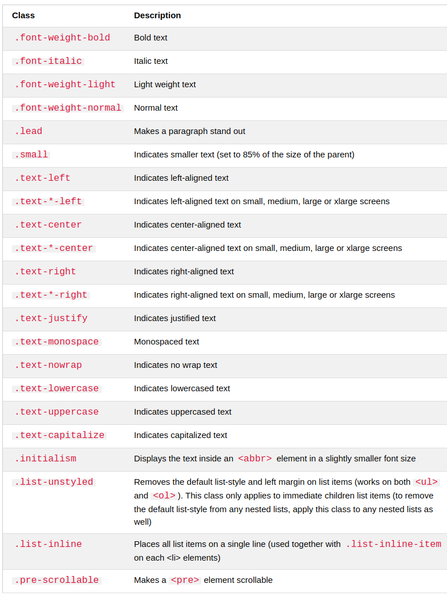
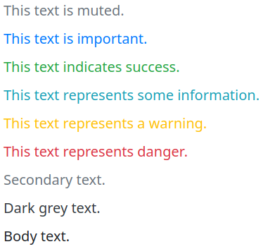
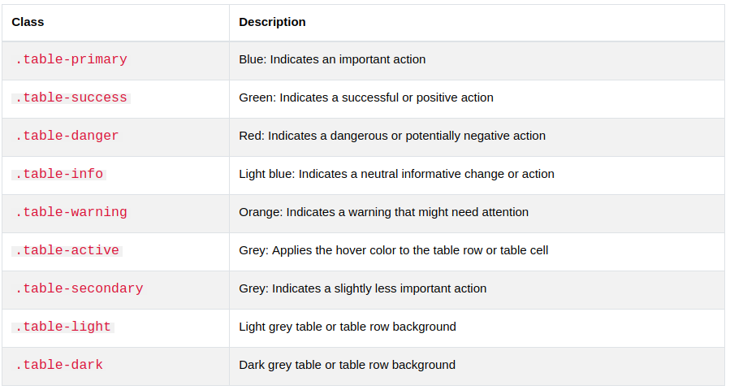
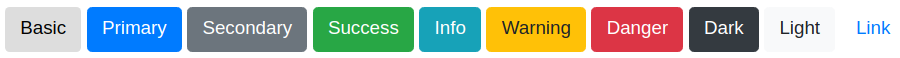
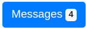
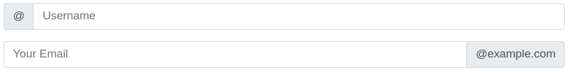
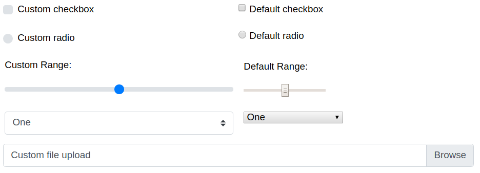

# Bootstrap 4 Cheat Sheet

### Requirement
1. html5
2. viewport
  * <meta name="viewport" content="width=device-width, initial-scale=1">
3. container
  * .container        # fixed width
  * .container-fluid  # full width

### Grid
12 columns
* .col- (extra small devices - screen width less than 576px)
* .col-sm- (small devices - screen width equal to or greater than 576px)
* .col-md- (medium devices - screen width equal to or greater than 768px)
* .col-lg- (large devices - screen width equal to or greater than 992px)
* .col-xl- (xlarge devices - screen width equal to or greater than 1200px)

```html
<!-- Control the column width, and how they should appear on different devices -->
<div class="row">             <!-- start with row -->
  <div class="col-*-*"></div>
  <div class="col-*-*"></div>
</div>
<div class="row">
  <div class="col-*-*"></div>
  <div class="col-*-*"></div>
  <div class="col-*-*"></div>
</div>

<!-- Or let Bootstrap automatically handle the layout -->
<div class="row">
  <div class="col"></div>
  <div class="col"></div>
  <div class="col"></div>
</div>
```

### Typography
```html
<h1> to <h6>
.display-1 ... .display-4
<h1 class="display-4">Display 4</h1>
<h1>h1 heading <small>secondary text</small></h1>

<!-- abbr: dotted -->
<p>The <abbr title="World Health Organization">WHO</abbr> was founded in 1948.</p>

<!-- blockquote & blockquote-footer -->
<blockquote class="blockquote">
  <p>For 50 years, WWF has been protecting the future of nature. The world's leading conservation organization, WWF works in 100 countries and is supported by 1.2 million members in the United States and close to 5 million globally.</p>
  <footer class="blockquote-footer">From WWF's website</footer>
</blockquote>

<dl>
<code>
<kbd>
<pre>
```


### Color
```css
.text-muted
.text-primary
.text-success
.text-info
.text-warning
.text-danger
.text-secondary
.text-white
.text-dark
.text-body
.text-light
```

Also can be used on **link**



Background colors
```css
.bg-primary
.bg-success
.bg-info
.bg-warning
.bg-danger
.bg-secondary
.bg-dark
.bg-light
```

### table
```css
.table
.table-striped
.table-hover
.table-dark
.table-borderless
```


```html
Note: This can be used on <table>, <tr>, <th>, <td>
```

```css
.table-sm    // small table
.table-responsive
.table-responsive-sm
.table-responsive-md
.table-responsive-lg
.table-responsive-xl
```
```html
<div class="table-responsive">
  <table class="table">
```

### Images
```css
.rounded
.rounded-circle
.img-thumbnail      // bordered
.float-right
.float-left
.mx-auto .d-block   // set margin auto and display to block
.img-fluid          // responsive
```

### Jumbotron
```css
.jumbotron
.jumbotron-fluid
```
```html
<!-- full width jumbotron -->
<div class="jumbotron jumbotron-fluid">
  <div class="container">
    <h1>Bootstrap Tutorial</h1> 
```

### Alert
```css
.alert
.alert-success
.alert-info
.alert-warning
.alert-danger
.alert-primary
.alert-secondary
.alert-light
.alert-dark
```
```html
<div class="alert alert-success">
  <strong>Success!</strong> Indicates a successful or positive action.
</div>

<!-- .alert-link -->
<div class="alert alert-success">
  <strong>Success!</strong> You should <a href="#" class="alert-link">read this message</a>.
</div>

<!-- close alerts -->
<!-- .alert-dismissible .close data-dismiss="alert" -->
<div class="alert alert-success alert-dismissible">
  <button type="button" class="close" data-dismiss="alert">&times;</button>
	<strong>Success!</strong> Indicates a successful or positive action.
</div>

<!-- animated alerts -->
<div class="alert alert-danger alert-dismissible fade show">
```

### Buttons

```css
.btn
.btn-primary
.btn-secondary
.btn-secondary
.btn-success
.btn-info
.btn-warning
.btn-danger
.btn-dark
.btn-light
.btn-link
```
```html
Note: Above class can be used on <a>, <button> and <input>
```
```html
<a href="#" class="btn btn-info" role="button">Link Button</a>
<button type="button" class="btn btn-info">Button</button>
<input type="button" class="btn btn-info" value="Input Button">
<input type="submit" class="btn btn-info" value="Submit Button">
```

Button Outline
```
.btn-outline-*  // * refer to primary ...
```

Button Size, Block level, Active/Disabled
```css
.btn-lg
.btn-sm
.btn-block
.active			// like pressed
.disabled		// use disable class for a, use diabled for button
```

Button Groups
```html
<div class="btn-group btn-group-lg">
  <button type="button" class="btn btn-primary">Apple</button>

<div class="btn-group-vertical">
  <button type="button" class="btn btn-primary">Apple</button>
```

```css
.btn-group
.btn-group-lg
.btn-group-sm
.btn-group-vertical
```
```
Note: Can combine with drop down
```
```html
<div class="btn-group">
  <button type="button" class="btn btn-primary">Apple</button>
  <button type="button" class="btn btn-primary">Samsung</button>
  <div class="btn-group">
    <button type="button" class="btn btn-primary dropdown-toggle" data-toggle="dropdown">
       Sony
    </button>
    <div class="dropdown-menu">
      <a class="dropdown-item" href="#">Tablet</a>
      <a class="dropdown-item" href="#">Smartphone</a>
    </div>
  </div>
</div>
```

### Badges
```css
.badge
.badge-primary
.badge-secondary  // other color refer to button
.badge-pill       // more round
```
```html
<h1>Example heading <span class="badge badge-secondary">New</span></h1>

<!-- badge inside button -->
<button type="button" class="btn btn-primary">
  Messages <span class="badge badge-light">4</span>
</button>
```


### Progress bar
```css
.progress
.progress-bar
.progress-bar-striped
.progress-bar-animated
.bg-primary
.bg-*
```

```html
<!-- set height, label -->
<div class="progress" style="height:20px">
  <div class="progress-bar" style="width:40%;height:20px">70%</div>
</div>

<!-- color -->
<div class="progress">
  <div class="progress-bar bg-success" style="width:20%"></div>
</div>

<!-- stacked -->
<div class="progress">
  <div class="progress-bar bg-success" style="width:40%">
    Free Space
  </div>
  <div class="progress-bar bg-warning" style="width:10%">
    Warning
  </div>
  <div class="progress-bar bg-danger" style="width:20%">
    Danger
  </div>
</div>
```

### Pagination
```css
.pagination
.page-item
.page-link
.active     // highlight
.disable    // can not click
.pagination-lg
.pagination-sm
.justify-content-center
.justify-content-end
.breadcrumb
.breadcrumb-item
```
```html
<ul class="pagination">
  <li class="page-item"><a class="page-link" href="#">Previous</a></li>
  <li class="page-item"><a class="page-link" href="#">1</a></li>
  <li class="page-item active"><a class="page-link" href="#">2</a></li>

<!-- alignment -->
<!-- Default (left-aligned) -->
<ul class="pagination" style="margin:20px 0">
  <li class="page-item">...</li>
</ul>

<!-- Center-aligned -->
<ul class="pagination justify-content-center" style="margin:20px 0">
  <li class="page-item">...</li>
</ul>

<!-- Right-aligned -->
<ul class="pagination justify-content-end" style="margin:20px 0">
  <li class="page-item">...</li>
</ul>
```

### List Groups
```css
.list-group
.list-group-item
.active
.disabled
.list-group-item-action   // use <div><a> instead of <ul><li>
.list-group-flush         // remove some borders and rounded corners
.list-group-item-success  // colors, list-group-item-*, * refer to button
```

```html
<!-- list group with contextual classes -->
<div class="list-group">
  <a href="#" class="list-group-item list-group-item-action">Action item</a>
	<a href="#" class="list-group-item list-group-item-action list-group-item-success">Success item</a>
	<a href="#" class="list-group-item list-group-item-action list-group-item-secondary">Secondary item</a>

<!-- list group with badges -->
<ul class="list-group">
  <li class="list-group-item d-flex justify-content-between align-items-center">
    Inbox
    <span class="badge badge-primary badge-pill">12</span>
  </li><Paste>
```

### Card
```css
.card
.card-body
.card-header
.card-footer
.bg-primary 	// colors, .bg-*, * refer to button
.card-title
.card-text
.card-img-top
.card-img-bottom
.card-img-overlay
.card-columns   // masonry-lke grid of cards
.card-deck      // a grid of cards that are of equal height and width
.card-group     // removes left and right margins of .card-deck
```

```html
<div class="card">
  <div class="card-body">
    <h4 class="card-title">Card title</h4>
    <p class="card-text">Some example text. Some example text.</p>
    <a href="#" class="card-link">Card link</a>
    <a href="#" class="card-link">Another link</a>
  </div>
</div>
```

### Dropdowns
```css
.dropdown
.dropdown-toggle
data-toggle="dropdown"    // attribution
.dropdown-menu
.dropdown-divider
.dropdown-header
.active
.disabled
.dropright
.dropleft
.dropdown-menu-right
.dropup
.dropdown-item
.dropdown-item-text     // use with <a>, <span>
```

```html
<div class="dropdown">
  <button type="button" class="btn btn-primary dropdown-toggle" data-toggle="dropdown">
    Dropdown button
  </button>
  <div class="dropdown-menu">
    <a class="dropdown-item" href="#">Link 1</a>
    <a class="dropdown-item" href="#">Link 2</a>
    <a class="dropdown-item" href="#">Link 3</a>
  </div>
</div>
```

```
Note: Can work with button group
```

### Collapse
```css
.collapse
data-target="#demo"     // attribution
.show
.accordion              // use with .card
```

```html
<button data-toggle="collapse" data-target="#demo">Collapsible</button>
<div id="demo" class="collapse">
Lorem ipsum dolor text....
</div>

<a href="#demo" data-toggle="collapse">Collapsible</a>
<div id="demo" class="collapse">
Lorem ipsum dolor text....
</div>
```

### Navs
```css
.nav
.nav-item
.nav-link
.disabled
.justify-content-center
.justify-content-end
.flex-column            // vertical nav
.nav-tabs               // tabs
.nav-pills
```

```
Note: Can work with drop down and toggle
```

### Navbar
```css
.navbar
.navbar-expand-xl|lg|md|sm    // Create a vertical bar without this
.navbar-nav
.nav-link
.nav-item
.justify-content-center       // put centered
.bg-primary                   // bg color, bg-*, bg-success, refer to button
.navbar-light                 // fg color
.disabled
.navbar-brand                 // brand/logo
.navbar-toggler               // for collapse
.navbar-text
.fixed-top                    // fixed at top
.fixed-bottom
.sticky-top
```

```html
<nav class="navbar navbar-expand-sm bg-light">
  <!-- Links -->
  <ul class="navbar-nav">
    <li class="nav-item">
      <a class="nav-link" href="#">Link 1</a>
    </li>
    <li class="nav-item">
      <a class="nav-link" href="#">Link 2</a>
    </li>
    <li class="nav-item">
      <a class="nav-link" href="#">Link 3</a>
    </li>
  </ul>
</nav>

<!-- collapse -->
<nav class="navbar navbar-expand-md bg-dark navbar-dark">
  <!-- Brand -->
  <a class="navbar-brand" href="#">Navbar</a>

  <!-- Toggler/collapsibe Button -->
  <button class="navbar-toggler" type="button" data-toggle="collapse" data-target="#collapsibleNavbar">
    <span class="navbar-toggler-icon"></span>
  </button>

  <!-- Navbar links -->
  <div class="collapse navbar-collapse" id="collapsibleNavbar">
    <ul class="navbar-nav">
      <li class="nav-item">
        <a class="nav-link" href="#">Link</a>
      </li>
      <li class="nav-item">
        <a class="nav-link" href="#">Link</a>
      </li>
      <li class="nav-item">
        <a class="nav-link" href="#">Link</a>
      </li> 
    </ul>
  </div> 
</nav>

<!-- can drop down also -->

<!-- work with form -->
<nav class="navbar navbar-expand-sm bg-dark navbar-dark">
  <form class="form-inline" action="/action_page.php">
    <input class="form-control mr-sm-2" type="text" placeholder="Search">
    <button class="btn btn-success" type="submit">Search</button>
  </form>
</nav>
```

### Forms
* Full width form
* Inline form

```css
.form-group     // proper margin
.form-control   // full width
.form-inline
.form-check
.form-check-label
.form-check-input
.form-check-inline
.form-control-sm
.form-control-lg
.form-control-plaintext
.form-control-range
.form-control-file
```

```html
<!-- full width form -->
<form action="/action_page.php">
  <div class="form-group">
    <label for="email">Email address:</label>
    <input type="email" class="form-control" id="email">
  </div>
  <div class="form-group">
    <label for="pwd">Password:</label>
    <input type="password" class="form-control" id="pwd">
  </div>
  <div class="form-group form-check">
    <label class="form-check-label">
      <input class="form-check-input" type="checkbox"> Remember me
    </label>
  </div>
  <button type="submit" class="btn btn-primary">Submit</button>
</form>

<!-- inline form -->
<form class="form-inline" action="/action_page.php">
  <label for="email">Email address:</label>
  <input type="email" class="form-control" id="email">
  <label for="pwd">Password:</label>
  <input type="password" class="form-control" id="pwd">
  <div class="form-check">
    <label class="form-check-label">
      <input class="form-check-input" type="checkbox"> Remember me
    </label>
  </div>
  <button type="submit" class="btn btn-primary">Submit</button>
</form>

<!-- with spacing -->
<form class="form-inline" action="/action_page.php">
  <label for="email" class="mr-sm-2">Email address:</label>
  <input type="email" class="form-control mb-2 mr-sm-2" id="email">
  <label for="pwd" class="mr-sm-2">Password:</label>
  <input type="password" class="form-control mb-2 mr-sm-2" id="pwd">
  <div class="form-check mb-2 mr-sm-2">
    <label class="form-check-label">
      <input class="form-check-input" type="checkbox"> Remember me
    </label>
  </div>
  <button type="submit" class="btn btn-primary mb-2">Submit</button>
</form>

<!-- textarea -->
<div class="form-group">
  <label for="comment">Comment:</label>
  <textarea class="form-control" rows="5" id="comment"></textarea>
</div>

<!-- checkbox -->
<div class="form-check">
  <label class="form-check-label">
    <input type="checkbox" class="form-check-input" value="">Option 1
  </label>
</div>
<div class="form-check">
  <label class="form-check-label">
    <input type="checkbox" class="form-check-input" value="">Option 2
  </label>
</div>

<!-- range, file -->
<input type="range" class="form-control-range">
<input type="file" class="form-control-file border">
```

### Input Groups


```css
.input-group
.input-group-prepend
.input-group-append
.input-group-text
.input-group-sm
.input-group-lg
```

```html
<form>
  <div class="input-group mb-3 input-group-sm">
     <div class="input-group-prepend">
       <span class="input-group-text">Small</span>
    </div>
    <input type="text" class="form-control">
  </div>
</form>

<!-- input with check box -->
<div class="input-group mb-3">
  <div class="input-group-prepend">
    <div class="input-group-text">
      <input type="checkbox"> 
    </div>
  </div>
  <input type="text" class="form-control" placeholder="Some text">
</div>

<!-- input with button -->
<div class="input-group mb-3">
  <input type="text" class="form-control" placeholder="Search">
  <div class="input-group-append">
    <button class="btn btn-success" type="submit">Go</button> 
  </div>
</div>

<!-- input with drop down -->
<div class="input-group mt-3 mb-3">
  <div class="input-group-prepend">
    <button type="button" class="btn btn-outline-secondary dropdown-toggle" data-toggle="dropdown">
      Dropdown button
    </button>
    <div class="dropdown-menu">
      <a class="dropdown-item" href="#">Link 1</a>
      <a class="dropdown-item" href="#">Link 2</a>
      <a class="dropdown-item" href="#">Link 3</a>
    </div>
  </div>
  <input type="text" class="form-control" placeholder="Username">
</div>
```

### Custom Forms

```css
.custom-control
.custom-checkbox
.custom-control-input
.custom-control-label
.custom-control-inline
.custom-select
.custom-select-sm
.custom-select-lg
.custom-range
.custom-file
```

```html
<form>
  <div class="custom-control custom-checkbox">
    <input type="checkbox" class="custom-control-input" id="customCheck" name="example1">
    <label class="custom-control-label" for="customCheck">Check this custom checkbox</label>
  </div>
</form>

<!-- custom file -->
<form>
  <div class="custom-file">
    <input type="file" class="custom-file-input" id="customFile">
    <label class="custom-file-label" for="customFile">Choose file</label>
  </div>
</form>
```

### Carousel
A slideshow for cycling through elements.
```css
.carousel
.slide
.carousel-indicators
.carousel-inner
.carousel-item
.carousel-control-prev
.carousel-control-next
.carousel-control-prev-icon
.carousel-control-next-icon
```

```html
<div id="demo" class="carousel slide" data-ride="carousel">

  <!-- Indicators -->
  <ul class="carousel-indicators">
    <li data-target="#demo" data-slide-to="0" class="active"></li>
    <li data-target="#demo" data-slide-to="1"></li>
    <li data-target="#demo" data-slide-to="2"></li>
  </ul>

  <!-- The slideshow -->
  <div class="carousel-inner">
    <div class="carousel-item active">
      
    </div>
    <div class="carousel-item">
      
    </div>
    <div class="carousel-item">
      
    </div>
  </div>

  <!-- Left and right controls -->
  <a class="carousel-control-prev" href="#demo" data-slide="prev">
    <span class="carousel-control-prev-icon"></span>
  </a>
  <a class="carousel-control-next" href="#demo" data-slide="next">
    <span class="carousel-control-next-icon"></span>
  </a>

</div>

<!-- caption -->
<div class="carousel-item">
  
  <div class="carousel-caption">
    <h3>Los Angeles</h3>
    <p>We had such a great time in LA!</p>
  </div>
</div>
```

### Model
```css
.modal
.modal-dialog
.modal-content
.modal-header
.modal-title
.modal-body
.modal-footer
.fade
.modal-sm
.modal-lg
.modal-dialog-centered
```

```html
<!-- Button to Open the Modal -->
<button type="button" class="btn btn-primary" data-toggle="modal" data-target="#myModal">
  Open modal
</button>

<!-- The Modal -->
<div class="modal" id="myModal">
  <div class="modal-dialog">
    <div class="modal-content">

      <!-- Modal Header -->
      <div class="modal-header">
        <h4 class="modal-title">Modal Heading</h4>
        <button type="button" class="close" data-dismiss="modal">&times;</button>
      </div>

      <!-- Modal body -->
      <div class="modal-body">
        Modal body..
      </div>

      <!-- Modal footer -->
      <div class="modal-footer">
        <button type="button" class="btn btn-danger" data-dismiss="modal">Close</button>
      </div>

    </div>
  </div>
</div>
```

### Tooltip
```
data-toggle="tooltip"
title="xxx"
data-placement="top"  //bottom, left, right
```

```html
<a href="#" data-toggle="tooltip" title="Hooray!">Hover over me</a>

<!-- must be initialized -->
<script>
	$(document).ready(function(){
		$('[data-toggle="tooltip"]').tooltip(); 
	});
</script>
```

### Popover
```
Popover is similar to tooltips - pop-up box
```

```html
<a href="#" data-toggle="popover" title="Popover Header" data-content="Some content inside the popover">Toggle popover</a>

<!-- must be initialized -->
<script>
	$(document).ready(function(){
		$('[data-toggle="popover"]').popover(); 
	});
</script>

<!-- use data-placement to set position like tooltips -->
data-trigger="focus"
data-trigger="hover"
```

### Utilities
```css
.border
.border-0
.border-top-0
.border-right-0
.border-bottom-0
.border-left-0
.border-primary   // color, ...
.rounded
.rounded-top 			// right bottom left circle 0

.clearfix
.float-left
.float-right

.float-sm-right		// responsive
.float-md-right
.float-lg-right
.float-xl-right
.float-none

.mx-auto				// centered, margin-left/right auto

.w-25						// width
.w-50
.w-75
.w-100
.mw-100

.h-25						// height
.h-50
.h-75
.h-100
.mh-100

.shadow-none
.shadow
.shadow-sm
.shadow-lg

.align-baseline		// vertical aligh: top, middle, bottom, text-top, text-bottom

.embed-responsive
.embed-responsive-21by9
.embed-responsive-16by9
.embed-responsive-4by3
.embed-responsive-1by1

.visible
.invisible

.fixed-top

.text-muted
.text-primary		// text color

```

### Spacing
```
Bootstrap 4 has a wide range of responsive margin and padding utility classes. They work for all breakpoints: xs (<=576px), sm (>=576px), md (>=768px), lg (>=992px) or xl (>=1200px)):

The classes are used in the format: {property}{sides}-{size} for xs and {property}{sides}-{breakpoint}-{size} for sm, md, lg, and xl.

Where property is one of:
m - sets margin
p - sets padding

Where sides is one of:
t - sets margin-top or padding-top
b - sets margin-bottom or padding-bottom
l - sets margin-left or padding-left
r - sets margin-right or padding-right
x - sets both padding-left and padding-right or margin-left and margin-right
y - sets both padding-top and padding-bottom or margin-top and margin-bottom
blank - sets a margin or padding on all 4 sides of the element

Where size is one of:
0 - sets margin or padding to 0
1 - sets margin or padding to .25rem (4px if font-size is 16px)
2 - sets margin or padding to .5rem (8px if font-size is 16px)
3 - sets margin or padding to 1rem (16px if font-size is 16px)
4 - sets margin or padding to 1.5rem (24px if font-size is 16px)
5 - sets margin or padding to 3rem (48px if font-size is 16px)
auto - sets margin to auto
```

### Flex
```html
<div class="d-flex flex-row bg-secondary">
  <div class="p-2 bg-info">Flex item 1</div>
  <div class="p-2 bg-warning">Flex item 2</div>
  <div class="p-2 bg-primary">Flex item 3</div>
</div>

<div class="d-flex flex-row-reverse bg-secondary">
  <div class="p-2 bg-info">Flex item 1</div>
  <div class="p-2 bg-warning">Flex item 2</div>
  <div class="p-2 bg-primary">Flex item 3</div>
</div>
```

### Media
```html
<div class="media border p-3">
  
  <div class="media-body">
    <h4>John Doe <small><i>Posted on February 19, 2016</i></small></h4>
    <p>Lorem ipsum...</p>
  </div>
</div>
```

### Filters
