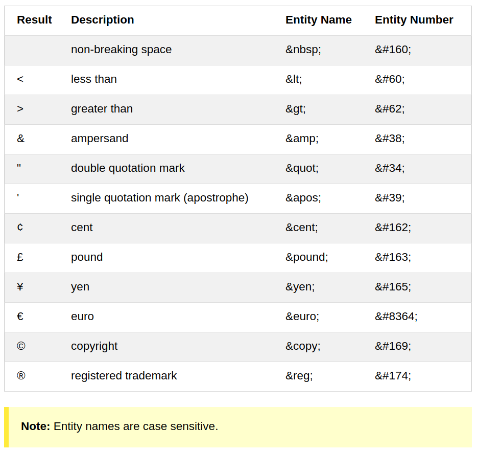

# HTML5 Cheat Sheet

[Another good HTML5 Cheat Sheet - The Ultimate HTML5 Cheat Sheet](https://www.wpkube.com/html5-cheat-sheet)

### Simple Example
```html
<!DOCTYPE html>
<html>
  <head>
    <title>TITLE</title>
  </head>
<body>
</body>
</html>
```

### Heading, important for SEO to know structure
```html
<h1> ... <h6>
<button>Click me</button>
```

### style
```html
<p style="color:red">xxxx</p>
```

### lang
*important for SEO*
```html
<html lang="en-US">
```

### title, tooltip
```html
<p title="tooltip">xxx</p>
```

```html
<br />
<hr />  # Horizontal rule
```

### preformatted text
```html
<pre>
  xxx

  xxx
</pre>
```

### HTML Formatting Elements
```html
<b>bold
<strong>important text
<i>italic text
<em>emphasized text
<mark>marked text
<small>small text
<del>deleted text
<ins>inserted text
<sub>subscript text
<sup>superscript text
```

### Quote
```html
<q>
<blockquote>
<abbr title="xxx">ABC</abbr>
<address>
<cite>
<bdo>bi-directional override/another direction
```

### Comment
```html
<!-- Comments -->
```

### CSS
```html
<head>
  <style>
  ...
  </style>
  <link rel="stylesheet" href="styles.css">
</head>
```

### Link
```html
<a href="" target="" title="">Link</a>
<a href="link">
  
</a>
```

css
* a:link
* a:visited
* a:hover
* a:active

```
target
* _blank
* _self
* _parent  parent frame
* _top
* framename   nested frame
```

Jump to anchor
```html
<h2 id="C4">Chapter 4</h2>
<a href="#C4">xxx</a>
```

### img
Use sylte instead of width/height to prevent changing from styles sheet
```html

```

### Image maps
Image-map is an image with clickable areas.
```html


<map name="workmap">
  <area shape="rect" coords="34,44,270,350" alt="Computer" href="computer.htm">
  <area shape="rect" coords="290,172,333,250" alt="Phone" href="phone.htm">
  <area shape="circle" coords="337,300,44" alt="Coffee" href="coffee.htm">
</map>
```

### background image
```html
<p style="background-image:url('cloud.jpg'">
...
</p>
```

### picture
Browser can choose the image that best fits the current view and/or device.

Each <source> element have attributes describing when their image is the most suitable.
```html
<picture>
  <source media="(min-width: 650px)" srcset="img_pink_flowers.jpg">
  <source media="(min-width: 465px)" srcset="img_white_flower.jpg">
  
</picture>
```

### table
```html
<table>
<caption>
<tr>
<th rowspan="2">
<td>
```
```css
table, th, td {
  border: 1px solid black;
  border-collapse: collapse;
}
table#t01 tr:nth-child(even) {
    background-color: #eee;
}
table#t01 tr:nth-child(odd) {
    background-color: #fff;
}
table#t01 th {
    color: white;
    background-color: black;
    }
```

### list
```html
<ul style="list-style-type:disc">
  <li>Coffee</li>
  <li>Tea</li>
  <li>Milk</li>
</ul>

<ol type="1" start="50">
  <li>Coffee</li>
  <li>Tea</li>
  <li>Milk</li>
</ol>
```

#### Description list
```html
<dl>
  <dt>Coffee</dt>
  <dd>- black hot drink</dd>
  <dt>Milk</dt>
  <dd>- white cold drink</dd>
</dl>
```

#### Horizontal list
```html
<!DOCTYPE html>
<html>
<head>
<style>
ul {
    list-style-type: none;
    margin: 0;
    padding: 0;
    overflow: hidden;
    background-color: #333333;
}

li {
    float: left;
}

li a {
    display: block;
    color: white;
    text-align: center;
    padding: 16px;
    text-decoration: none;
}

li a:hover {
    background-color: #111111;
}
</style>
</head>
<body>

<ul>
  <li><a href="#home">Home</a></li>
  <li><a href="#news">News</a></li>
  <li><a href="#contact">Contact</a></li>
  <li><a href="#about">About</a></li>
</ul>

</body>
</html>
```

### head
```html
<meta charset="UTF-8">
<meta name="description" content="xxx asdf">
<meta name="keyword" content="xx,bb,cc">
<meta name="author" content="xxx">
<meta http-equiv="refresh" content="30"> <!-- refresh every 30 seconds -->
```

#### Viewport
```html
<meta name="viewport" content="width=device-width, initial-scale=1.0">
```

### Layout


```html
* <header> - Defines a header for a document or a section
* <nav> - Defines a container for navigation links
* <section> - Defines a section in a document
* <article> - Defines an independent self-contained article
* <aside> - Defines content aside from the content (like a sidebar)
* <footer> - Defines a footer for a document or a section
* <details> - Defines additional details
* <summary> - Defines a heading for the <details> element
```

Four different ways to create multicolumn layouts
* HTML tables (not recommended)
* CSS float property
* CSS flexbox
* CSS framework

### Responsive Web Design
```html
<!-- Set viewport -->
<meta name="viewport" content="width=device-width, initial-scale=1.0">

<!-- Make image responsive -->


<!-- Make image only scale down not up -->


<!-- Use different images -->
<picture>
  <source srcset="img_smallflower.jpg" media="(max-width: 600px)">
  <source srcset="img_flowers.jpg" media="(max-width: 1500px)">
  <source srcset="flowers.jpg">
  
</picture>

<!-- Responsive Text Size with vw -->
<h1 style="font-size:10vw">Hello World</h1>

<!-- Use Media Queries to set different style -->
<style>
.left, .right {
  float: left;
  width: 20%; /* The width is 20%, by default */
}

.main {
  float: left;
  width: 60%; /* The width is 60%, by default */
}

/* Use a media query to add a breakpoint at 800px: */
@media screen and (max-width: 800px) {
.left, .main, .right {
  width: 100%; /* The width is 100%, when the viewport is 800px or smaller */
  }
}
</style>

```

### Computer Code
```html
<code>
<kbd>  <!-- keyboard input -->
<samp> <!-- for program output -->
<var>
<var>E</var> = <var>mc</var><sup>2</sup>
```

### Entities
&entity_name;

&#entity_number;



### Symbol Entities
[Full Math Reference](https://www.w3schools.com/charsets/ref_utf_math.asp)

[Full Greek Reference](https://www.w3schools.com/charsets/ref_utf_greek.asp)

[Full Currency Reference](https://www.w3schools.com/charsets/ref_utf_currency.asp)

[Full Arrows Reference](https://www.w3schools.com/charsets/ref_utf_arrows.asp)

[Full Symbols Reference](https://www.w3schools.com/charsets/ref_utf_symbols.asp)

### Form
```html
<form action="" method="get" target="blank_">
  First name:<br>
  <input type="text" name="firstname"><br>

  <input type="radio" name="gender" value="male" checked> Male<br>

  <input type="submit" value="Submit">

  <fieldset>
    <legend>Personal information:</legend>
    First name:<br>
    <input type="text" name="firstname" value="Mickey"><br>
    Last name:<br>
    <input type="text" name="lastname" value="Mouse"><br><br>
    <input type="submit" value="Submit">
  </fieldset>

  <select name="cars" size="1" multiple>
    <!-- use size to specify the number of visible values -->
    <!-- use multiple for multi choices -->
    <option value="volvo">Volvo</option>
    <option value="saab" selected>Saab</option>
  </select>

  <textarea name="message" rows="10" cols="30">
  The cat was playing in the garden.
  </textarea>

  <textarea name="message" style="width:200px; height:600px">
  The cat was playing in the garden.
  </textarea>

  <button type="button" onclick="alert('Hello World!')">Click Me!</button> <!-- always specify type -->

  <!-- drop down munu -->
  <input list="browsers">
  <datalist id="browsers">
    <option value="Internet Explorer">
    <option value="Firefox">
    <option value="Chrome">
    <option value="Opera">
    <option value="Safari">
  </datalist>

  <input type="range"  id="a" name="a" value="50">
  <input type="number" id="b" name="b" value="50">
  <output name="x" for="a b"></output>

  <select>
    <optgroup label="Swedish Cars">
      <option value="volvo">Volvo</option>
      <option value="saab">Saab</option>
    </optgroup>
    <optgroup label="German Cars">
      <option value="mercedes">Mercedes</option>
      <option value="audi">Audi</option>
    </optgroup>
    </select>
</form>
```

### Input
```html
<input type="text" name="firstname">
<input type="password" name="psw">
<input type="submit" value="Submit">
<input type="reset">  <!-- reset all form values -->
<input type="radio" name="gender" value="male" checked> Male
<input type="checkbox" name="vehicle2" value="Car"> I have a car
<input type="button" onclick="alert('Hello World!')" value="Click Me!">
<input type="color" name="favcolor">
<input type="date" name="bday">
<input type="date" name="bday" min="2000-01-02"><br>
<input type="datetime-local" name="bdaytime">
<input type="email" name="email">
<input type="file" name="myFile">
<input type="month" name="bdaymonth">
<input type="number" name="quantity" min="1" max="5">
<input type="search" name="googlesearch">
<input type="time" name="usr_time">
<input type="url" name="homepage">
<input type="week" name="week_year">
<input type="image" src="img_submit.gif" alt="Submit" width="48" height="48">
<input list="browsers">
<datalist id="browsers">
  <option value="Internet Explorer">
  <option value="Firefox">
</datalist>
```

### Input Restriction
* disable
* max
* maxlength
* min
* pattern
* readonly
* required
* size
* step
* value
* autocomplete
* autofocus
* placeholder
* form
* formaction
* formenctype
* formmethod
* formvalidate
* formtarget
* height
* width
* multiple
